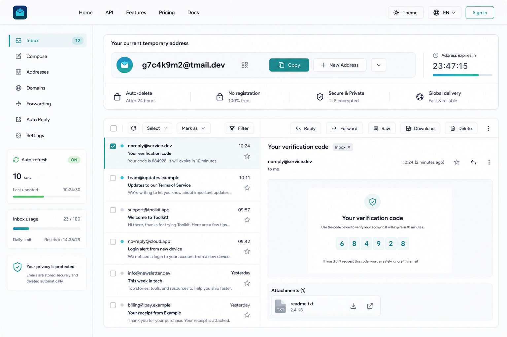

# 临时邮箱前端 UI 改版 PRD

版本：v1.0  
日期：2026-05-12  
范围：`frontend/` 用户侧首页、邮箱工作台、导航与基础视觉系统  
参考概念图：
完整 UI 参考图集：[`assets/ui-reference/`](assets/ui-reference/)

## 1. 背景

当前前端基于 Vue 3、Naive UI 和开源项目默认组件样式实现，功能完整，但视觉识别度偏弱：页面主要依赖默认页头、默认卡片、默认标签页和默认列表，品牌感集中在通用信封 logo 上。对首次访问用户来说，产品价值不够直观；对高频用户来说，邮箱操作台的信息层级、状态反馈和操作效率仍有提升空间。

本次改版目标是把前端从“开源模板感”升级为“可信、轻量、可长期使用的临时邮箱工作台”。改版不改变后端 API、认证模型和核心业务逻辑，优先通过布局、视觉系统、组件组织和交互反馈提升体验。

## 2. 产品定位

Cloudflare Temp Email 是一个面向隐私、快速验证、临时注册和自动化场景的临时邮箱工具。前端应该传达三个关键词：

- 快速：用户打开页面后能立即看到当前地址、复制地址、查看收件箱。
- 可信：界面应突出安全、自动清理、隐私保护、传输可靠等状态。
- 高效：收件箱、阅读、筛选、刷新、下载、删除等常用操作应集中、清晰、可连续完成。

## 3. 目标

### 3.1 用户目标

- 新用户能在 10 秒内理解当前页面用于接收临时邮件，并找到登录或获取地址入口。
- 新用户能根据后端提供的多个邮箱域名选择更适合自己的地址域名，再创建临时邮箱。
- 已有地址用户能在首屏完成复制地址、切换地址、刷新邮件、查看最新邮件。
- 高频用户能通过双栏工作台快速筛选、选择、阅读、下载和删除邮件。
- 移动端用户能在窄屏上保持清晰路径，不被桌面复杂控件压缩。
- Telegram WebApp 场景保持轻量，不引入占空间的桌面导航。

### 3.2 业务目标

- 提升产品可信度和自建部署项目的专业感。
- 降低用户因界面默认、信息分散导致的误操作或流失。
- 为后续新增品牌配置、主题配置、欢迎页或公开演示站留出设计空间。
- 为付费套餐、角色权益和额度展示预留清晰入口，支持从免费工具平滑升级到商业化服务。

### 3.3 技术目标

- 复用现有 Vue 3、Naive UI、Vue Router、VueUse 状态模型。
- 不新增后端接口作为本次改版的前置条件。
- 不改变现有认证头、API 路径、邮箱处理流程、i18n 框架。
- 保持现有桌面端、移动端、Telegram 模式、深色模式、广告侧栏逻辑可用。

## 4. 非目标

- 不重写 Worker API、D1 schema、邮件解析、SMTP/IMAP 代理。
- 不在 UI 改版第一阶段直接接入支付网关、发票、退款、税务或订阅账务系统。
- 不把首页改成营销落地页。首屏仍应是可操作的邮箱工作台。
- 不强制替换全部 Naive UI 组件库。
- 不引入复杂动效、视频背景或大面积装饰插画。
- 不在 UI 中展示虚假的安全能力；所有状态文案应与现有能力匹配。

## 5. 用户画像

### 5.1 匿名快速使用者

场景：临时注册网站、接收验证码、避免暴露真实邮箱。  
需求：快速复制地址、等待验证码、读取最新邮件。  
关注点：是否免费、是否需要注册、邮件多久到达、地址是否会过期。

### 5.2 登录后的高频用户

场景：长期维护多个临时地址、需要发送邮件、管理地址、查历史邮件。  
需求：地址切换、筛选邮件、批量下载或删除、设置自动回复和 webhook。  
关注点：操作效率、邮件列表可读性、配置入口是否明确。

### 5.3 自建部署管理员

场景：部署给团队或公开站点使用，关注品牌、可信度和维护成本。  
需求：站点标题、GitHub 链接、状态页、广告位、管理入口、用户管理。  
关注点：界面是否专业、是否易于配置、是否影响现有部署。

### 5.4 移动端与 Telegram 用户

场景：手机内接收验证码、Telegram 小程序里查看邮件。  
需求：单手复制地址、刷新、阅读最新邮件。  
关注点：控件不能拥挤，输入框字号避免 iOS 自动缩放，抽屉阅读体验清晰。

## 6. 设计原则

- 工作台优先：用户打开页面后看到的是可操作界面，而不是营销介绍。
- 信息分层：地址、状态、邮件列表、邮件内容、设置入口各有明确区域。
- 控件紧凑：保留工具属性，不使用过大的 hero 字体或装饰卡片。
- 品牌克制：用色、阴影、图标和背景提升质感，但不牺牲可读性。
- 响应式分流：桌面端以双栏效率为主，移动端以单列任务流为主。
- 可配置：自建部署站点的标题、GitHub、状态页、广告、语言和主题能力继续可控。

## 7. 当前能力约束

### 7.1 现有认证与入口

现有前端依赖以下能力，改版必须保留：

- `/api/*` 使用 `Authorization: Bearer <jwt>` 访问地址邮箱能力。
- `/user_api/*` 使用 `x-user-token` 访问用户账号能力。
- `/admin/*` 使用 `x-admin-auth` 管理后台能力。
- `x-custom-auth` 支持全局访问密码。
- `x-lang` 支持语言偏好。
- Public endpoints 包括登录、注册、OAuth2、Passkey 相关接口。

### 7.2 现有前端状态

改版需要兼容 `frontend/src/store/index.js` 的全局状态：

- `settings.address`：当前地址是否存在。
- `openSettings`：站点公开设置、开关和功能能力。
- `openSettings.domains`：后端提供的可用邮箱域名列表，前端展示时应使用 label/value 映射。
- `openSettings.defaultDomains`：匿名用户或无角色用户默认可用的邮箱域名范围。
- `openSettings.randomSubdomainDomains`：允许创建随机子域名地址的基础域名。
- `userSettings.user_role.domains`：登录用户角色可用的邮箱域名范围。
- `isDark`：深色模式。
- `useSimpleIndex`：简洁模式。
- `indexTab`、`globalTabplacement`：当前标签与标签位置。
- `autoRefresh`、`configAutoRefreshInterval`：收件箱自动刷新。
- `isTelegram`、`telegramApp`：Telegram 环境。

## 8. 信息架构

### 8.1 桌面端目标结构

桌面端采用五层结构：

1. 顶部导航：品牌、主要入口、语言、主题、登录或账号入口。
2. 左侧导航：收件箱、写信、地址、域名、转发、自动回复、设置等工作区入口。
3. 当前地址区：临时地址、域名标识、复制、新地址或地址管理、过期/刷新状态、核心信任点。
4. 邮件工作台：左侧邮件列表，右侧邮件阅读与附件区。
5. 辅助状态区：自动刷新、用量、隐私保护提示、广告位或站点状态。

### 8.2 移动端目标结构

移动端采用单列任务流：

1. 顶部栏：logo、当前页面标题、菜单按钮。
2. 当前地址卡：地址、域名选择/标识、复制、刷新或管理入口。
3. 邮件列表：最新邮件优先，筛选和刷新紧贴列表。
4. 邮件详情：底部抽屉或全屏详情页。
5. 设置入口：通过菜单、抽屉或分段控件进入。

### 8.3 Telegram 模式

Telegram 模式应优先保持轻量：

- 不显示完整桌面侧边栏。
- 不使用占空间的辅助卡片。
- 保留地址、刷新、复制、邮件阅读的核心路径。
- 适配 Telegram WebApp 的安全区域和主题。

## 9. 功能需求

### 9.1 顶部导航

#### 描述

顶部导航从默认 `n-page-header` 升级为品牌化应用顶栏。顶栏应保持高度紧凑，避免营销站导航喧宾夺主。

#### 需求

- 显示品牌 logo 和站点标题，标题来自 `openSettings.title`，无配置时使用 i18n 默认标题。
- 桌面端显示主要入口：Home、User、Admin、Docs 或 GitHub，具体可见性遵循现有开关。
- 显示语言切换、主题切换、GitHub/version 入口。
- 移动端折叠为菜单按钮，菜单内保留语言、主题、GitHub、User、Admin。
- logo 连点进入 Admin 的隐藏逻辑保持可用，但不应影响普通点击体验。

#### 验收标准

- 桌面宽度大于 1024px 时，顶栏一行内不换行、不遮挡。
- 375px 移动宽度下，标题不溢出，菜单可打开并可关闭。
- 深色模式下顶栏与页面背景对比清晰。

### 9.2 左侧工作区导航

#### 描述

参考概念图，桌面端引入更明确的左侧工作区导航，替代当前全部依赖顶部标签页的结构。已有标签页能力可在第一阶段保留为内部路由或内容切换实现，但视觉上应呈现为工作区导航。

#### 导航项

- Inbox：收件箱，默认入口。
- Compose：写信，仅在 `openSettings.enableSendMail` 为 true 时显示。
- Addresses：地址管理。
- Forwarding：转发设置，按现有能力显示。
- Auto Reply：自动回复，仅在 `openSettings.enableAutoReply` 为 true 时显示。
- Webhook：Webhook 设置，仅在 `openSettings.enableWebhook` 为 true 时显示。
- Attachments：S3 附件，仅在 `openSettings.isS3Enabled` 为 true 时显示。
- Appearance：外观设置。
- About：关于，仅在 `openSettings.enableIndexAbout` 为 true 时显示。

#### 验收标准

- 当前激活项有明确高亮。
- 不可用功能不显示空入口。
- 移动端不常驻显示侧边栏，改为抽屉或顶部菜单。

### 9.3 当前临时地址区

#### 描述

当前地址是临时邮箱产品的核心操作，应从普通 alert 样式升级为首屏主操作模块。

#### 需求

- 显示标题：当前临时地址。
- 显示当前地址，文本可选择，长地址在小屏幕下可省略但必须支持复制。
- 当前地址必须明确展示所使用的邮箱域名。若域名配置了展示 label，应优先展示 label，同时保证用户复制到的是完整真实地址。
- 主操作按钮：复制地址。
- 次操作入口：地址管理、新地址或切换域名。具体能力根据当前登录状态、Telegram 状态、地址管理能力和可用域名范围显示。
- 可选显示二维码或凭证入口，沿用现有 `AddressCredentialModal`。
- 显示状态信息：
  - 自动删除策略，例如“24 小时后自动删除”，具体文案需与实际配置一致。
  - 无需注册或账号状态，不能误导登录态用户。
  - 安全与隐私提示，例如“邮件仅用于当前临时地址访问”，避免过度承诺。
  - 全球投递或 Cloudflare 部署提示，仅在站点希望展示时显示。

#### 状态处理

- `settings.fetched === false`：显示骨架屏。
- `settings.address` 存在：显示地址区。
- `isTelegram` 且无地址：显示 Telegram 地址获取流程。
- `userJwt` 存在但无地址：显示地址管理入口。
- 匿名且无地址：显示地址登录/获取区域与用户登录入口。

#### 验收标准

- 复制成功/失败有明确 toast。
- 地址文本不会撑破容器。
- 骨架屏高度稳定，不造成大幅布局跳动。

#### 多域名选择与创建

后端支持多个邮箱域名，前端改版必须把“选择域名”提升为地址创建流程中的一等能力，而不是隐藏在普通输入框末尾。

需求：

- 创建新地址时，域名选择器必须清晰展示所有当前用户可用域名。
- 匿名用户使用 `openSettings.defaultDomains` 限定后的域名；如果该配置为空或未配置，则展示后端返回的可用域名集合。
- 登录用户如果存在 `userSettings.user_role.domains`，只展示该角色允许的域名；否则展示默认域名范围。
- 域名展示应使用 `openSettings.domains` 中的 `{ label, value }`。`label` 用于 UI 可读性，`value` 用于真实请求和地址拼接。
- 域名数量较多时，选择器必须支持搜索或分组，避免长列表难以使用。
- 当前地址切换器应在地址列表中保留域名 label 映射，帮助用户区分同名前缀不同域名的地址。
- 若某域名在 `openSettings.randomSubdomainDomains` 中，创建地址时显示“启用随机子域名”选项，并解释生成结果会形如 `name@random.example.com`。
- 如果用户选择了不支持随机子域名的域名，随机子域名选项必须自动关闭并隐藏或禁用。
- 若后端返回无可用域名，应显示可恢复错误状态，并引导联系管理员或检查部署配置。
- 移动端域名选择器不得压缩地址名称输入框；必要时将“名称”和“域名”拆成上下两行。

验收标准：

- 使用多个域名配置时，用户能明确选择目标域名创建地址。
- 角色限制生效时，用户只能看到角色允许的域名。
- `DOMAIN_LABELS` 或等价 label 配置生效时，UI 展示 label，接口仍提交真实 domain value。
- 随机子域名开关只在允许的基础域名上出现。
- 长域名、中文 label、多级子域名在桌面和移动端都不造成横向溢出。

#### 按 IP 和域名限制创建数量

为防止同一来源批量占用邮箱地址，系统应支持“同一 IP 在每个邮箱域名下最多创建 N 个临时邮箱”的配额限制。例如配置为 5 时，`1.2.3.4` 可以在 `a.com` 下创建最多 5 个地址，也可以在 `b.com` 下创建最多 5 个地址，但不能在同一个域名下继续创建第 6 个。

后端规则：

- 限制必须在后端强校验，不能只依赖前端隐藏按钮。
- 默认建议配置项为“每 IP 每域名最多 5 个地址”，实际数值应可由部署者配置。
- 计数维度为 `client_ip + normalized_base_domain`。
- `client_ip` 优先使用 `CF-Connecting-IP`，其次使用可信代理头；无法识别 IP 时应按 `unknown` 或更严格策略处理。
- `normalized_base_domain` 使用用户创建时选择的允许域名，而不是最终随机子域名，防止用户通过 `random.a.com`、`random2.a.com` 绕过 `a.com` 的额度。
- 如果启用了直接子域名匹配，例如允许 `team.a.com` 匹配 `a.com`，计数也应归入被匹配到的允许域名 `a.com`。
- `/api/new_address` 必须执行该限制。
- Telegram 创建地址接口也应执行同类限制，避免同一 IP 或 Telegram 场景绕过公开页面限制。
- 管理员 `/admin/new_address` 可默认不受该限制，但建议保留可配置开关，便于公开管理面板场景统一策略。
- 达到限制时，接口返回明确错误，例如“该 IP 在此域名下创建邮箱数量已达上限”，并使用 429 或 400；推荐 429 表示配额/频控类限制。
- 已删除地址是否释放额度需要产品明确。建议第一版按当前仍存在的地址计数，删除后释放额度；如果后续要防滥用，应增加按时间窗口计数。

数据规则：

- 现有 `address.source_meta` 已记录创建来源 IP，可用于查询历史创建数。
- 查询时应从完整地址中解析域名并映射到允许的 base domain；不能只做字符串后缀模糊匹配，避免 `badexample.com` 被错误归到 `example.com`。
- 如果现有查询性能不足，可新增索引或独立计数表，但 PRD 不要求第一版必须新建表。

前端规则：

- 创建地址前，如果后端提供当前域名剩余额度，域名选择器旁展示“还可创建 X 个”。
- 如果后端暂不提供预查询接口，前端至少要在创建失败后展示后端返回的限制原因，并保留用户已输入的地址名和选择的域名。
- 域名切换时，额度提示应跟随域名变化。
- 当某域名额度已满时，该域名仍可展示，但应标记“已达上限”并禁用创建，避免用户误以为域名不可用。
- 移动端提示应放在域名选择器下方，不挤占地址名称输入框。

验收标准：

- 同一 IP 在同一域名下创建第 6 个地址时被拒绝。
- 同一 IP 在不同域名下分别拥有独立额度。
- 随机子域名创建不会绕过基础域名额度。
- 直接指定子域名创建不会绕过匹配到的基础域名额度。
- 前端能清楚展示或反馈额度已满原因。

#### 多邮箱切换与管理

产品应允许用户创建并持有多个临时邮箱，但主收件箱默认始终只展示“当前活跃地址”的邮件，避免用户误以为正在查看所有地址的聚合收件箱。

核心模型：

- 当前活跃地址：页面当前使用的邮箱地址，所有 `/api/*` 邮件读取、删除、发送、自动回复等操作都作用于该地址。
- 地址库：用户可切换的地址集合。登录用户来自 `/user_api/bind_address`，匿名用户来自本地 `LocalAddressCache`，Telegram 用户来自 `/telegram/get_bind_address`。
- 地址切换：选择某个地址后获取或恢复对应 JWT，更新 `jwt` 并刷新当前工作台。
- 地址管理：用于创建、绑定、解绑、转移、删除和复制多个地址。

桌面端交互：

- 当前地址主卡中提供地址选择器，展示当前活跃地址，并允许搜索切换其他地址。
- 地址选择器按来源分组：用户地址、本地地址、Telegram 地址。不同来源的地址不要混在同一平铺列表中。
- 每个地址项至少展示完整邮箱地址、域名 label、当前活跃标识。已有数据可用时展示收件数、发件数。
- 选择非当前地址时，不弹二次确认；切换成功后刷新邮件列表并回到收件箱。
- 地址管理入口打开管理面板或页面，支持表格/列表管理所有地址。
- 地址管理面板中的操作包括：
  - 切换：设为当前活跃地址。
  - 复制：复制完整邮箱地址。
  - 查看凭证：打开 `AddressCredentialModal` 或等价凭证弹窗，不在列表中直接暴露 JWT。
  - 新建地址：进入多域名创建流程。
  - 解绑：仅解除账号与地址关系，不删除邮箱数据。适用于登录用户地址。
  - 删除地址：删除地址及其邮件数据，必须作为危险操作并二次确认。仅在后端能力和权限允许时显示。
  - 转移地址：沿用现有用户地址转移能力，仅登录用户显示。

移动端交互：

- 当前地址卡只展示当前活跃地址、复制按钮和“切换”按钮，避免在卡片内塞入完整表格。
- 点击“切换”打开底部抽屉，抽屉内提供搜索、分组地址列表、新建地址入口。
- 地址管理的危险操作进入二级详情页或更多菜单，不放在移动端列表首层。
- 切换成功后关闭抽屉，并显示当前活跃地址更新结果。

匿名用户规则：

- 匿名用户可在本地保存多个地址凭证，列表来源为 `LocalAddressCache`。
- 移除本地地址只表示从当前浏览器移除凭证，不等同于删除邮箱地址和邮件数据。
- 若用户清空浏览器存储，本地地址列表会丢失；PRD 不要求第一版提供匿名云同步。

登录用户规则：

- 登录用户创建新地址后，应自动绑定到当前账号，并可立即设为当前活跃地址。
- 登录用户绑定已有地址后，该地址进入用户地址库。
- 解绑地址后，如果解绑的是当前活跃地址，应提示用户选择另一个地址或回到创建/绑定流程。
- 删除地址和解绑地址必须在文案上明确区分，避免用户误删邮件数据。

收件箱范围：

- 第一版不做“全部地址聚合收件箱”。
- 若未来需要聚合收件箱，应单独设计跨地址 API、权限校验、分页、筛选和删除语义，不能在前端循环请求多个地址拼接。

验收标准：

- 用户拥有多个地址时，可以在 2 次点击内切换当前活跃地址。
- 切换地址后，地址卡、邮件列表、发送身份、设置页都同步到新地址。
- 当前活跃地址在地址列表中有明确标记。
- 解绑和删除在 UI 文案上清楚区分。
- 匿名用户移除本地地址时，不出现“删除邮箱数据”的误导文案。
- 移动端能完成地址切换、新建地址、复制地址，不出现横向表格溢出。

#### 付费套餐与权益展示

付费能力应建立在现有“用户账号 + 用户角色 + 地址数量限制 + 域名范围 + 发信额度 + 邮箱保留期”的基础上，先做权益识别和展示，再接入自动化支付。第一版可以由管理员手动给用户分配角色，后续再接支付系统自动升级。

套餐建议：

- Free：匿名或普通登录用户。提供基础域名、较低的每 IP 每域名创建上限、有限地址数量、邮件短期保留、默认发信余额为 0 或少量试用额度。
- Plus：轻量付费用户。提供更多可绑定地址、更高创建额度、更多可用域名、可选短域名、更长邮件保留期、较高发信余额、Webhook/自动回复等高级功能。
- Pro：高频或开发者用户。提供高级域名池、更高地址数量、更多发信额度、随机子域名能力、永久邮箱或长期保留能力、API/SMTP/IMAP 代理能力入口、优先支持。
- Admin/Owner：站点管理员或自建部署者。拥有后台访问、用户管理、额度配置、域名管理和异常处理能力。

权益映射：

- 可用域名：通过 `USER_ROLES.domains` 控制不同套餐可选域名。
- 地址前缀：通过 `USER_ROLES.prefix` 给付费用户提供专属前缀或无前缀能力。
- 地址数量：通过现有角色地址数量配置控制不同套餐最大绑定地址数。
- 邮箱保留期：通过地址级保留策略控制免费短期清理、付费长期保留和永久邮箱。
- 发信权益：通过 `DEFAULT_SEND_BALANCE`、`address_sender.balance`、`NO_LIMIT_SEND_ROLE` 和免额度地址列表控制。
- 创建限制：免费用户使用更严格的每 IP 每域名上限，付费用户可提高或豁免。
- 高级能力：发送邮件、Webhook、自动回复、S3 附件、AI 提取、SMTP/IMAP 代理等能力可作为套餐权益展示，但实际开关必须以当前后端能力为准。

产品入口：

- 顶部导航可预留“Upgrade”或“Plans”入口，但自建部署默认可关闭。
- 当前地址区展示当前套餐名、地址数量使用情况、发信余额和域名权益摘要。
- 当用户触及限制时，显示明确的限制原因和升级入口，例如地址数已达上限、当前域名不可用、发信余额不足。
- 设置页增加“套餐与用量”区域，展示角色、可用域名、地址上限、当前地址数、发信余额、创建额度和邮箱保留期。
- 管理后台保留用户角色编辑能力，作为没有支付系统时的手动开通方式。

支付集成边界：

- 第一阶段不接入支付系统，只展示角色权益和升级占位。
- 第二阶段可接入第三方支付或自有订单系统，将支付成功事件映射为用户角色变更。
- 支付回调必须由后端验证签名，不能由前端直接授予角色。
- 订阅过期、退款、取消订阅应降级角色，并保留用户已有地址的处理策略。
- 不在邮件正文、地址 JWT、本地存储中保存支付状态；支付状态必须以后端用户角色或订阅记录为准。

降级策略：

- 用户从付费套餐降级到免费套餐后，已有地址不应被立即删除。
- 超出免费额度的地址可进入只读或不可切换状态，要求用户删除、解绑或重新升级。
- 发信余额不足时禁用发送，不影响收信。
- 付费域名创建的历史地址在降级后是否可继续接收邮件需要产品确认。建议继续接收，但禁止新建同权益域名地址。
- 永久邮箱在订阅过期后不应立即删除，应进入宽限期；宽限期结束仍未续费时，按降级后的保留期策略处理。

验收标准：

- 未接支付时，管理员仍可通过角色分配模拟付费套餐。
- 用户能看到当前套餐、地址数量、发信余额和可用域名范围。
- 用户能看到每个地址的保留状态：临时、长期、永久、宽限期或即将清理。
- 触发地址数量、域名权限、发信余额、IP 域名创建额度限制时，前端能给出清楚解释。
- 付费入口可通过配置隐藏，适配纯自建免费部署。
- 前端不会基于本地状态自行授予付费权益。

#### 邮箱保留期与永久邮箱业务模型

本产品主打临时邮箱，因此免费层应保持明确的自动清理策略；付费升级的核心价值是“更长保留期、专属域名、更多地址和永久邮箱”。推荐使用“每天执行清理任务 + 按地址保留策略判断是否删除”的模型，而不是用“每周才跑清理任务”表达产品承诺。每天跑任务可以让系统稳定回收 D1 存储；保留多久由套餐决定。

保留期建议：

- Free 24h：匿名或未付费地址，邮件和地址默认保留 1 天。适合验证码、一次性注册、短期下载链接。
- Free 7d：如果希望降低用户压力，可把登录免费用户设为 7 天保留，匿名用户仍为 1 天。
- Plus 30d：付费轻量用户，邮件保留 30 天，地址在订阅有效期内保留。
- Pro 365d：高频用户，邮件保留 365 天或更长，支持更多地址和高级域名。
- Permanent Mailbox：永久邮箱。订阅有效期内不参与自动清理；如是一次性购买，则在服务可用和用户遵守规则的前提下长期保留。

清理语义：

- “每天清理一次”是后台任务频率，不等于所有邮箱只活一天。
- “一周清理一次”可以作为低成本部署的运维选项，但产品文案应仍写保留期，例如“免费邮件最多保留 7 天”，不能写成清理任务时间。
- 永久邮箱不是普通临时地址的自然状态，必须有明确标记，清理任务默认跳过。
- 对免费地址，清理可以删除邮件、发送记录、空地址和长期未活跃地址。
- 对付费永久地址，清理只能删除系统允许删除的临时缓存，不能删除地址、邮件正文、发件箱记录和绑定关系。
- 对未知邮件、无地址邮件、无效地址邮件仍可按全局清理策略处理，不受付费邮箱保护。

地址级状态：

- `temporary`：临时地址，按套餐保留期清理。
- `extended`：长期地址，按 30 天、365 天等策略清理。
- `permanent`：永久地址，自动清理跳过。
- `grace`：订阅过期宽限期，继续收信但限制新建、发送或高级功能。
- `expired`：宽限期结束，进入降级或待清理状态。

业务套餐设计：

| 套餐 | 目标用户 | 地址数量 | 每 IP 每域名创建限制 | 邮件保留 | 域名权益 | 发信额度 | 价格策略 |
| ---- | -------- | -------- | -------------------- | -------- | -------- | -------- | -------- |
| Free Anonymous | 一次性验证码用户 | 1-3 个本地地址 | 5/域名 | 24 小时 | 基础域名 | 0 | 免费 |
| Free Account | 注册用户 | 5 个绑定地址 | 5/域名 | 7 天 | 基础域名 | 少量试用或 0 | 免费 |
| Plus | 轻量长期用户 | 20 个绑定地址 | 20/域名 | 30 天 | 基础域名 + 短域名 | 中等额度 | 月付/年付 |
| Pro | 开发者/高频用户 | 100 个绑定地址 | 100/域名 | 365 天 | 高级域名 + 随机子域名 | 高额度或不限 | 月付/年付 |
| Permanent Add-on | 希望长期保留单个地址的用户 | 按地址购买 | 可豁免 | 永久 | 购买时选择的域名 | 单独配置 | 一次性或年费 |

永久邮箱有两种商业形态：

- 套餐型永久：Pro 用户可拥有若干个永久邮箱，订阅有效则永久保留，订阅过期进入宽限期。
- 单地址永久：用户为某个地址单独购买永久保留权，适合“我只想长期保留一个邮箱”的场景。该模式更适合临时邮箱产品，因为不会强迫用户订阅完整套餐。

推荐产品组合：

- 免费：临时邮箱，24 小时或 7 天自动清理。
- Plus：长期临时邮箱，30 天保留，更多地址和更高额度。
- Pro：长期重度使用，365 天保留和高级能力。
- Permanent Add-on：单个地址永久保留，作为最清晰的付费卖点。

前端展示：

- 地址卡展示保留状态，例如“24 小时后清理”“还剩 6 天”“永久邮箱”“宽限期剩余 5 天”。
- 地址列表展示保留 badge，帮助用户区分临时地址和永久地址。
- 创建地址流程中提供“创建临时邮箱”和“升级为永久邮箱”的分支。
- 当临时邮箱即将清理时，在地址卡和邮件列表顶部显示提醒，并提供升级入口。
- 购买永久邮箱时，必须让用户确认具体要保护的地址，避免以为所有地址都永久。

后端能力要求：

- 需要地址级保留策略，不能只依赖当前全局 `auto_cleanup` 天数。
- 当前全局清理逻辑会按 `raw_mails.created_at`、`address.created_at`、`address.updated_at` 删除数据；付费永久邮箱上线前必须改为跳过受保护地址。
- 建议新增地址元数据或独立表记录：`address_id`、`retention_type`、`retention_until`、`subscription_id`、`grace_until`、`is_permanent`。
- 清理任务可以每天运行，查询时按地址保留策略筛选可清理数据。
- 订阅状态变化必须由后端更新保留策略，前端不能直接修改永久状态。

降级与欠费：

- 订阅到期后进入 7-14 天宽限期。
- 宽限期内继续收信和查看历史邮件，但可以限制新建地址、发送邮件和高级能力。
- 宽限期结束后，套餐型永久邮箱转为免费或长期保留策略；单地址永久购买不受订阅过期影响。
- 清理前建议提供最后提醒，例如站内提示或邮件通知；如果没有可靠通知能力，至少在登录后提示。

合规与风控：

- 永久邮箱可能被用户当成正式邮箱使用，必须在产品文案中说明服务边界、滥用处理、账号安全和数据删除政策。
- 对滥用、欺诈、垃圾邮件、违法内容相关地址，管理员必须保留冻结、禁用、删除或强制降级能力。
- 支付状态、永久权益、订阅记录必须后端可信存储，不能放在 JWT 或 localStorage 作为唯一依据。

验收标准：

- 免费地址到达保留期后会被清理。
- 永久地址不会被普通邮件清理、地址清理、空地址清理误删。
- 地址卡、地址列表和套餐页都能展示保留状态。
- 用户可以把指定临时地址升级为永久邮箱。
- 订阅过期后进入宽限期，宽限期内不会立即删除历史邮件。
- 管理员可以查看地址的保留状态，并手动调整或撤销永久权益。

### 9.4 邮件工作台

#### 描述

邮件工作台是改版的主体。桌面端应呈现“列表 + 阅读”的双栏布局，移动端保留列表 + 抽屉详情。

#### 桌面端需求

- 顶部工具条包含：
  - 批量选择。
  - 刷新。
  - 自动刷新开关与倒计时。
  - 筛选输入。
  - 分页与 page size。
  - 批量下载。
  - 批量删除，仅在 `enableUserDeleteEmail` 为 true 时显示。
- 左侧邮件列表包含：
  - 选择框。
  - 未读/选中/当前邮件状态。
  - 发件人或收件人。
  - 主题。
  - 摘要。
  - 时间。
  - AI 提取信息 compact 展示。
- 右侧阅读区包含：
  - 邮件主题。
  - 发件人、收件人、时间。
  - Reply、Forward、Raw、Download、Delete 等操作，按现有能力显示。
  - 邮件正文渲染。
  - 附件区。
  - 删除确认。

#### 移动端需求

- 邮件列表上方保留刷新、自动刷新、分页和筛选。
- 邮件详情使用底部抽屉或独立全屏面板。
- 抽屉高度默认不超过 80vh，可滚动。
- 操作按钮在详情页内固定在顶部或底部，避免用户滚动到末尾才能删除/回复。

#### 空状态

- 无邮件时显示轻量空状态，不使用过大的插画。
- 空状态文案应引导用户复制地址并等待邮件，而不是只显示“暂无数据”。

#### 验收标准

- 桌面端选择一封邮件后，阅读区立即更新。
- 自动刷新不会打断用户正在阅读非第一页邮件。
- 筛选仅筛当前页时，应在 UI 中避免暗示全库搜索。
- 批量删除和下载在无选中项时给出明确提示。

### 9.5 简洁模式

#### 描述

现有 `SimpleIndex` 面向低干扰场景，应继续保留，但视觉上与新版保持一致。

#### 需求

- 保留进入/退出简洁模式能力。
- 简洁模式只保留地址、刷新、复制、设置、当前邮件阅读。
- 不显示完整侧边导航。
- 与主模式共用颜色、按钮、卡片、空状态规范。

#### 验收标准

- 简洁模式不会因新版布局引入多余导航。
- 桌面和移动端都可退出简洁模式。

### 9.6 发送邮件与发件箱

#### 描述

当 `openSettings.enableSendMail` 为 true 时，写信和发件箱应融入新版工作区。

#### 需求

- Compose 入口清晰显示。
- Reply/Forward 从邮件阅读区跳转到 Compose，并保留现有 `sendMailModel` 填充逻辑。
- SendBox 列表与 MailBox 共享视觉规范。
- 发件箱中的下载、删除、查看详情能力保持不变。

#### 验收标准

- 回复和转发不会丢失原邮件上下文。
- 发送邮件开关关闭时，不显示 Compose 和 SendBox 入口。

### 9.7 设置类页面

#### 描述

Auto Reply、Webhook、Attachment、Appearance、Account Settings 等配置页面应作为工作区内容页呈现，不再像孤立卡片堆叠。

#### 需求

- 页面标题、说明、表单区、保存按钮层次统一。
- 表单宽度限制在合理范围，避免超宽。
- 危险操作需要确认。
- Webhook JSON 编辑器保留等宽字体与可读高度。

#### 验收标准

- 所有设置页在 1440px 桌面宽度下不显得松散。
- 375px 移动宽度下表单字段不横向溢出。

## 10. 视觉需求

### 10.1 色彩

建议使用以下方向，不要求逐字等同：

- 页面背景：雾白、极浅青灰或深色模式下的低亮石墨。
- 主色：冷青色，用于复制按钮、选中态、进度条、关键入口。
- 强调色：少量绿色，用于安全、成功、在线状态。
- 文本：石墨黑、次级灰蓝、深色模式下的低刺眼白。
- 警告/危险：沿用 Naive UI 的 warning/error 语义色，但降低大面积使用。

### 10.2 圆角与阴影

- 常规容器圆角不超过 8px，保持工具感。
- 关键地址区可使用 10px 到 12px 圆角，但不应像营销卡片。
- 阴影要轻，只用于区分浮层、抽屉、顶栏或当前地址区。
- 不使用多层嵌套卡片。

### 10.3 背景资产

可以使用生成图作为灵感或后续资产方向：

- 背景应低对比，不能影响邮件文本阅读。
- 不使用可读文字、真实邮箱地址或第三方品牌。
- 不使用大面积蓝紫渐变、发光光斑、装饰球体。
- 若使用背景图，应提供浅色和深色适配策略。

### 10.4 图标

- 优先使用现有 `@vicons/material` 与 `@vicons/fa`。
- 工具按钮优先图标 + tooltip，关键按钮可用图标 + 文本。
- 不为简单图标生成 bitmap，除非是品牌 logo 或空状态插图。

### 10.5 字体与排版

- 不使用随视口宽度缩放的字体。
- 页面正文和工具区保持高可读性。
- 地址文本使用等宽或近似等宽展示，便于复制和识别。
- 长邮箱地址、长主题、长发件人必须省略或换行，不允许遮挡按钮。

## 11. 交互需求

### 11.1 复制地址

- 点击复制按钮后调用 Clipboard API。
- 成功提示应短，不遮挡主要工作区。
- 失败时提供可选择地址文本，允许用户手动复制。

### 11.2 自动刷新

- 自动刷新开关显示当前间隔或倒计时。
- 当用户不在第一页或正在阅读历史邮件时，不应强制跳回最新邮件。
- 手动刷新始终可用。

### 11.3 批量操作

- 进入批量模式后显示取消、全选、取消全选、删除、下载。
- 批量删除必须二次确认。
- 下载生成 zip 的过程要显示 loading 或结果弹窗。

### 11.4 邮件阅读

- 阅读区工具栏固定在邮件正文上方。
- Reply、Forward 只在发送能力开启时显示。
- Raw、Download、Delete 根据现有能力显示。
- 邮件正文中的外部内容与 HTML 渲染继续遵循现有安全处理。

## 12. 响应式要求

### 12.1 断点

- 小屏：小于 640px，单列布局。
- 中屏：640px 到 1024px，可使用简化双栏或单列。
- 大屏：大于 1024px，完整工作台。

### 12.2 移动端重点

- 输入框和选择器字体至少 16px，保留现有避免 iOS 自动缩放规则。
- 顶部区域不要超过首屏一半。
- 邮件主题、发件人、时间在列表中优先可读。
- 抽屉内正文可滚动，页面背景不应被误滚。

## 13. 深色模式

深色模式不是简单反色，需要单独保证：

- 背景层次可区分。
- 邮件正文 HTML 的白底内容保持可读。
- `ShadowHtmlComponent` 已有深色链接色，改版不能破坏。
- 主按钮和选中态在深色背景下不过曝。
- 空状态、骨架屏、边框在深色下可见。

## 14. 国际化

本项目已有多语言体系，改版新增文案必须：

- 进入 i18n source 或 message registry，不写死中文或英文。
- 至少提供中文和英文。
- 不破坏当前 locale 路由切换。
- 长文本在德语、西语、葡语等语言下不撑破按钮。

新增建议文案包括：

- 当前临时地址。
- 自动删除。
- 隐私受保护。
- 上次更新。
- 收件箱用量。
- 复制失败，请手动选择地址。
- 复制地址后等待邮件到达。
- 选择邮箱域名。
- 该域名支持随机子域名。
- 当前角色无可用域名，请联系管理员。
- 该 IP 在此域名下创建邮箱数量已达上限。
- 该域名还可创建 X 个邮箱。
- 该域名创建额度已满。
- 当前套餐。
- 升级套餐。
- 地址数量已达当前套餐上限。
- 当前套餐不可使用该域名。
- 发信余额不足。
- 付费入口已由管理员关闭。
- 临时邮箱。
- 长期邮箱。
- 永久邮箱。
- 邮箱保留期。
- 该邮箱将于 X 后清理。
- 宽限期剩余 X 天。
- 升级为永久邮箱。
- 此操作只保护当前地址。
- 当前邮箱。
- 切换邮箱。
- 设为当前邮箱。
- 地址已从本地列表移除。
- 解绑不会删除该邮箱和邮件数据。
- 删除邮箱将同时删除该地址下的邮件数据。

## 15. 可访问性

- 所有图标按钮必须有可感知标签或 tooltip。
- 键盘用户可以进入地址复制、刷新、筛选、邮件列表、阅读区。
- 颜色不能作为唯一状态表达，选中、未读、错误都需要形状或文字辅助。
- Toast 和弹窗不应永久阻塞页面。
- 主要文本对比度应满足 WCAG AA。

## 16. 性能要求

- 首屏不应依赖大图加载才能可用。
- 背景图如使用，应压缩并设置明确尺寸。
- 邮件列表仍按现有分页加载，不一次性拉取大量邮件。
- 图片资产应优先使用 `webp` 或经过压缩的 `png`。
- 改版后 `pnpm build` 产物不应显著增加；如果增加超过 200KB gzip，需要复核资产。

## 17. 数据与接口

本次 UI 改版默认不新增后端接口。所有数据来自现有接口：

- `api.getOpenSettings()`：站点公开设置。
- `api.getSettings()`：当前地址设置。
- `/api/mails?limit=&offset=`：邮件列表。
- `/api/mail/:id`：单封邮件。
- `/api/mails/:id`：删除邮件。
- `/api/sendbox`：发件箱。
- `/api/attachment/put_url`：附件上传到 S3。
- `/open_api/settings`：公开设置，包含 `domains`、`defaultDomains`、`domainLabels`、`randomSubdomainDomains` 等域名相关配置。
- `/api/new_address`：创建地址，提交 `name`、`domain`、`cf_token`、`enableRandomSubdomain`。
- 地址创建额度查询接口：如需创建前展示剩余额度，建议新增按当前 IP 和 domain 查询的公开接口；如果不新增接口，前端只处理 `/api/new_address` 的限制错误。
- `/user_api/bind_address`：获取或绑定当前用户的地址列表。
- `/user_api/bind_address_jwt/:address_id`：获取已绑定地址的 JWT，用于切换当前活跃地址。
- `/user_api/unbind_address`：解绑用户地址，不删除地址和邮件数据。
- `/user_api/transfer_address`：将地址转移给其他用户。
- `/api/delete_address`：删除当前地址及相关数据，必须作为危险操作使用。
- `/telegram/get_bind_address`：获取 Telegram 用户绑定地址。
- `/user_api/settings`：获取当前用户角色和账号状态，可用于套餐展示。
- `/admin/user_roles`、`/admin/role_address_config`：管理员配置和分配角色权益。
- 地址保留策略接口：后续需要新增地址级保留状态读取和管理接口，用于展示临时、长期、永久、宽限期和即将清理状态。
- 清理任务接口：现有 `/admin/auto_cleanup` 和 scheduled cleanup 需要扩展为尊重地址级保留策略。
- 支付相关接口：第一阶段不要求新增；后续如接支付，应新增后端订单、订阅状态、支付回调和角色同步接口。

如后续需要展示更精确的地址过期时间、用量上限或站点状态，应单独定义 API 需求，不纳入第一阶段。

## 18. 埋点与指标

本项目当前没有明确产品埋点体系，本次 PRD 只定义可观察指标，不强制新增埋点。

建议观察：

- 地址复制点击次数。
- 手动刷新点击次数。
- 邮件打开率。
- 移动端邮件详情打开率。
- 多域名场景下的新地址创建成功率。
- 各域名的新地址创建分布。
- 每 IP 每域名创建额度命中次数。
- 因创建额度达到上限导致的失败次数。
- 免费用户到升级入口点击次数。
- 付费限制触发次数：地址上限、域名权限、发信余额不足。
- 各套餐用户数量与活跃地址数。
- 临时地址升级为永久邮箱的转化率。
- 即将清理提醒展示次数和升级点击次数。
- 永久邮箱数量、活跃率和续费率。
- 宽限期用户恢复订阅比例。
- 多地址用户的地址切换次数。
- 地址解绑、删除、转移操作次数。
- 进入简洁模式次数。
- 批量下载和批量删除使用次数。
- 登录入口点击次数。

如果后续引入埋点，需要确保不记录邮件正文、真实地址凭证、JWT 或敏感 header。

## 19. 阶段规划

### Phase 1：视觉系统与应用框架

- 建立全局主题 token、背景、顶栏、主容器。
- 重构首页布局外壳，兼容广告侧栏。
- 引入新版 logo 或品牌标识资产。
- 保证深色模式可用。

### Phase 2：当前地址区与邮箱工作台

- 重构 AddressBar 视觉与状态。
- 强化新建地址流程中的域名选择、域名 label 展示、角色域名限制和随机子域名开关。
- 增加每 IP 每域名创建数量限制的错误反馈；如果后端提供额度查询，则展示剩余额度。
- 建立多地址切换与管理入口，明确当前活跃地址和地址库。
- 重构 MailBox 桌面双栏和移动列表/抽屉体验。
- 优化工具栏、筛选、刷新、批量操作。
- 补充空状态和 loading 状态。

### Phase 3：设置页与次级功能统一

- 统一 SendBox、SendMail、AccountSettings、Appearance、AutoReply、Webhook、Attachment 样式。
- 增加“套餐与用量”展示区，基于现有角色、地址数量和发信余额展示权益。
- 检查 Telegram 模式和 SimpleIndex。
- 完成 i18n 文案补齐。

### Phase 3.5：付费能力准备

- 用角色体系模拟 Free、Plus、Pro、Admin 套餐。
- 管理后台支持更清晰的用户角色和地址数量配置展示。
- 前端增加可配置的升级入口和套餐权益说明。
- 增加地址保留状态展示：临时、长期、永久、宽限期、即将清理。
- 改造清理策略设计，使自动清理跳过永久邮箱和受保护地址。
- 支付系统只做接口预留，不阻塞 UI 改版上线。

### Phase 3.6：永久邮箱商业化

- 支持将指定地址升级为永久邮箱。
- 支持套餐型永久和单地址永久两种权益模型。
- 支持订阅过期宽限期和降级后的保留策略。
- 管理后台支持查看和调整地址保留权益。

### Phase 4：QA 与文档

- 桌面、移动、深色、浅色截图检查。
- 跑 frontend build 和相关测试。
- 如涉及部署配置、公开文档或用户行为变化，更新中英文文档和 changelog。

## 20. 验收清单

### 功能验收

- 无地址、匿名地址、登录用户、Telegram 用户四类入口都可正常进入。
- 多域名配置下，地址创建、地址切换、地址 label 展示均正常。
- 多地址配置下，用户能切换当前活跃地址并看到对应邮件。
- 当前地址解绑、删除、转移的文案和权限显示正确。
- 角色域名限制下，不展示用户无权使用的域名。
- 随机子域名开关只对允许域名显示。
- 同一 IP 在同一域名下达到创建上限后不能继续创建。
- 达到创建上限时，前端保留用户输入并展示明确原因。
- 用户套餐、地址上限、域名权限和发信余额展示正确。
- 付费入口关闭时，界面不显示升级相关入口。
- 免费地址按保留期清理，永久邮箱不会被普通清理任务误删。
- 用户可以看到地址保留状态，并能把指定地址升级为永久邮箱。
- 邮件列表、邮件详情、删除、下载、回复、转发功能保持可用。
- 地址管理、自动回复、Webhook、附件、外观、关于页面按开关显示。
- Admin 和 User 路由入口不丢失。
- 语言切换和深色模式保持可用。

### 视觉验收

- 页面不再表现为默认 Naive UI 模板。
- 首屏明确突出当前临时地址和收件箱。
- 桌面端双栏工作台层次清晰。
- 移动端无横向滚动。
- 重要按钮文本不截断。
- 邮件 HTML 正文不被背景或容器样式影响。

### 技术验收

- `frontend` 可通过 `pnpm build`。
- 现有 Vitest 测试通过。
- 如改动影响 E2E，`e2e/` 对应场景需要通过。
- 不引入未使用的大型依赖。
- 不提交 secret 或环境变量值。

## 21. 风险与对策

### 风险：改动范围过大影响已有功能

对策：分阶段改造，先改外壳和视觉，再改具体功能组件；保留现有 API 调用和 store 状态。

### 风险：桌面侧边导航与现有 tabs 状态冲突

对策：第一阶段可保留 `indexTab` 作为内部状态，只改变触发和展示方式；后续再评估是否改为子路由。

### 风险：生成背景图影响可读性

对策：背景图只用于外层氛围，不放在正文容器后；正文区域始终使用稳定纯色或半透明低噪声表面。

### 风险：多语言文本导致按钮溢出

对策：工具区优先图标按钮 + tooltip，长文本操作在移动端折叠菜单。

### 风险：多域名选择增加地址创建复杂度

对策：把域名选择作为明确控件展示，默认选中当前可用范围内的首个域名；域名很多时支持搜索，角色受限时只展示可用域名，避免用户看到创建后会失败的选项。

### 风险：IP 维度额度误伤共享网络用户

对策：额度值必须可配置；错误文案说明是当前网络/IP 达到限制；管理员可通过配置提高额度或关闭限制。后续如需要更精细控制，可叠加用户账号、Turnstile、时间窗口或白名单。

### 风险：付费权益和真实权限不一致

对策：前端只展示后端返回的角色、额度和开关；所有付费权益必须由后端角色、配置和接口校验决定，不能依赖本地状态或前端隐藏按钮。

### 风险：过早接入支付导致范围失控

对策：先用角色体系手动模拟套餐，验证权益模型和 UI；支付网关、订阅、发票、退款和税务作为独立后续项目。

### 风险：降级后用户已有地址处理不清

对策：降级不立即删除地址；超额地址进入受限状态，禁止新建高权益地址，删除策略由用户或管理员显式操作。

### 风险：永久邮箱被全局清理任务误删

对策：上线永久邮箱前必须把清理逻辑从全局天数清理改为地址级保留策略；清理 SQL 必须排除 `permanent`、`grace` 和仍在保留期内的地址。

### 风险：“永久”承诺过强

对策：产品文案使用“订阅有效期内永久保留”或“单地址永久权益”，并在服务条款中说明滥用处理、服务可用性、备份和用户主动删除边界。

### 风险：免费清理周期影响转化和口碑

对策：匿名地址可 24 小时清理，登录免费用户建议 7 天保留；在清理前显示明确倒计时和升级入口，避免用户误以为邮件无故消失。

### 风险：随机子域名绕过域名额度

对策：额度计数归入用户选择或匹配到的基础域名，而不是最终生成的随机子域名。

### 风险：多地址管理让用户误解收件箱范围

对策：始终在地址主卡和邮件列表附近展示当前活跃地址；第一版不提供聚合收件箱，所有邮件操作都明确作用于当前地址。

### 风险：解绑和删除语义混淆

对策：解绑文案强调“仅从账号移除，不删除邮件数据”；删除文案强调“删除地址及该地址下邮件数据”，并使用危险色和二次确认。

### 风险：深色模式邮件正文不一致

对策：保留邮件正文隔离渲染策略，对外部 HTML 设置独立背景和文本颜色。

## 22. 待确认产品决策

以下决策建议在进入实现前确认：

- 桌面端是否正式引入左侧导航，还是只在现有 tabs 上做视觉强化。
- 新 logo 是否替换现有 `/logo.png`，还是先作为可选主题资产。
- 当前地址区是否展示“过期时间”。如果要展示真实倒计时，需要确认后端是否提供准确字段。
- 多邮箱域名是否需要在地址主卡中展示为独立 badge，还是只展示在完整邮箱地址内。建议多域名部署默认展示独立 badge。
- 域名数量较多时是否需要按业务标签分组，例如公共域名、短域名、私有域名、可随机子域名。
- 每 IP 每域名创建上限的默认值是否固定为 5。建议默认 5，并允许部署者通过环境变量或管理后台配置。
- 地址删除后是否释放每 IP 每域名额度。建议第一版释放额度，后续如遇滥用再增加时间窗口计数。
- 是否需要为登录用户、管理员、白名单 IP 或特定用户角色设置更高的创建额度。
- 付费套餐是否采用 Free、Plus、Pro 三档。建议先用角色体系验证，再决定最终命名和价格。
- 是否需要接入支付供应商，还是仅为自建部署保留手动授权模式。
- 付费用户降级后，超出新套餐额度的地址是只读、不可切换，还是要求立即处理。建议只读且不自动删除。
- 哪些能力应作为付费权益：高级域名、更多地址、发信额度、Webhook、自动回复、SMTP/IMAP 代理、AI 提取、S3 附件。
- 免费邮箱保留期采用 24 小时还是 7 天。建议匿名 24 小时，登录免费用户 7 天。
- 清理任务频率采用每日还是每周。建议每日执行，按保留期判断删除，避免 D1 存储不可控。
- 永久邮箱采用套餐包含、单地址购买，还是两者并存。建议两者并存，单地址永久作为主卖点。
- 永久邮箱是否承诺邮件正文永久保留，还是只承诺地址永久保留。建议明确区分“地址保留”和“邮件历史保留”。
- 订阅过期宽限期长度。建议 7-14 天。
- 多地址用户是否需要“默认地址”概念。建议第一版不做默认地址，只保留当前活跃地址。
- 是否需要“全部地址聚合收件箱”。建议第一版不做，避免分页、权限和删除语义复杂化。
- 是否保留概念图中的 Pricing、Features 等营销入口。建议自建工具默认不展示，公开 SaaS 站点再单独配置。
- 是否需要把本 PRD 拆成“用户侧首页”和“管理后台视觉统一”两个实施计划。建议先做用户侧首页。

## 23. 建议实施范围

第一版实施建议控制在以下文件附近：

- `frontend/src/App.vue`：全局布局、背景、主容器、广告侧栏适配。
- `frontend/src/views/Header.vue`：品牌顶栏、移动菜单、语言/主题/GitHub 入口。
- `frontend/src/views/Index.vue`：工作区结构、导航入口与内容切换。
- `frontend/src/views/index/AddressBar.vue`：当前地址主操作区。
- `frontend/src/components/MailBox.vue`：邮件工作台、工具栏、列表和阅读区。
- `frontend/src/components/SendBox.vue`：与 MailBox 统一视觉。
- `frontend/src/views/index/SimpleIndex.vue`：简洁模式统一视觉。
- `frontend/src/i18n/`：新增文案。
- `frontend/public/` 或 `frontend/src/assets/`：品牌图、背景图、空状态图等资源。

## 24. 成功标准

改版完成后，应达到以下结果：

- 用户一眼能识别当前临时邮箱地址和复制按钮。
- 收件箱像一个成熟的邮件工具，而不是默认列表组件堆叠。
- 新旧用户都能不读说明完成核心任务。
- 自建部署者不需要额外改代码，也能获得更专业的默认界面。
- 代码层面保持现有 API、状态和部署方式稳定。
